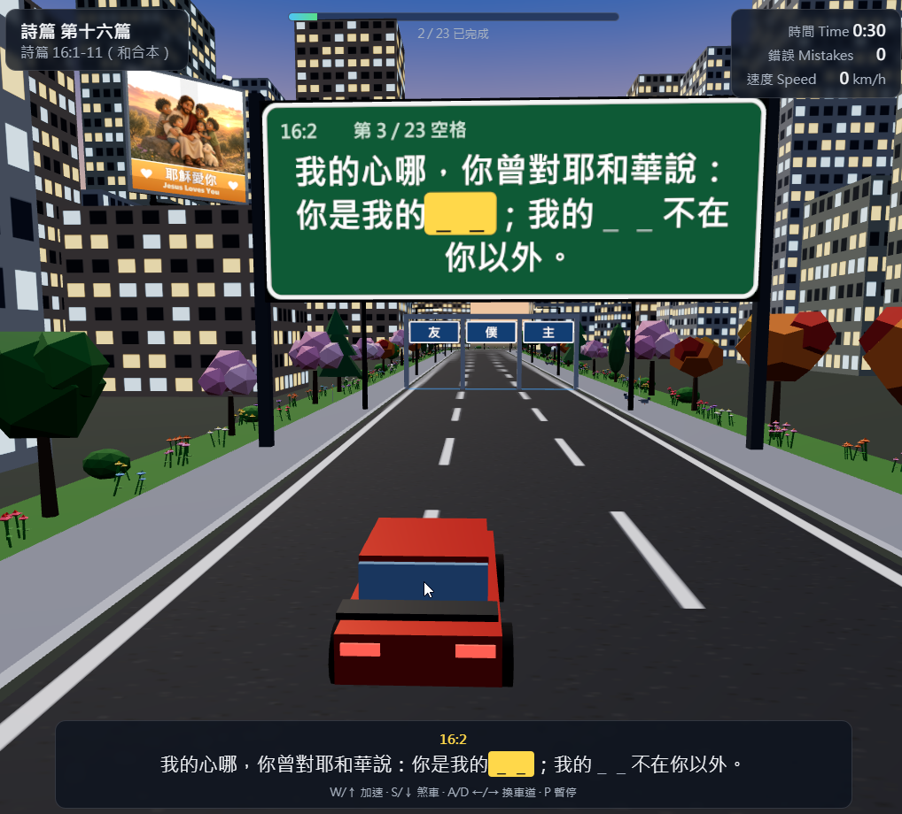
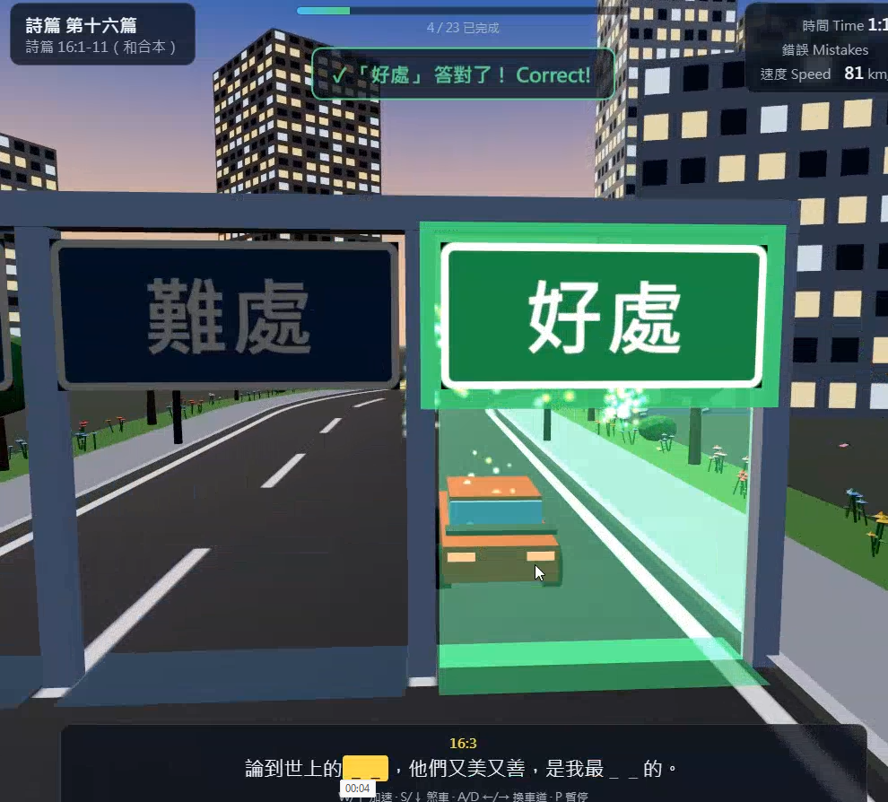

# 讀經複習 (Verse Driving)

3D city driving game for memorizing Bible verses. Drive through the gate with the correct word to fill in each blank.





## Run

```bash
npm install
npm run dev
```

Open http://localhost:5173/

## Controls

| Key | Action |
| --- | --- |
| W / ↑ | Accelerate |
| S / ↓ | Brake |
| A/D or ←/→ | Change lane |
| P / Esc | Pause |

On a phone or tablet, hold the on-screen buttons instead: **◀ / ▶** steer, **▲** accelerates, **▼** brakes, and **暫停** pauses. A connected keyboard still works. Add `?touch` to the URL to show the buttons on a desktop browser.

## Passages

Verse data lives in `public/passages/`. Edit the JSON and refresh the browser. No rebuild is needed.

The start screen lists every chapter in `public/passages/index.json`. The default is **詩篇 第十六篇** (Psalm 16). To open another chapter directly, use its id in the URL, for example `http://localhost:5173/?passage=psalm-23`.

### Change a verse

Open the chapter file, such as `public/passages/psalm-23.json`, and edit that verse's `text`. Keep `ref` as the verse number shown on the sign.

```json
{ "ref": "23:1", "text": "耶和華是我的[牧者|仇敵|審判]，我必不致[缺乏|富足|驕傲]。" }
```

The words outside the brackets are shown as-is. Refresh the browser to see the new sentence.

### Add a chapter

1. Create `public/passages/psalm-19.json`:

```json
{
  "id": "psalm-19",
  "title": "詩篇 第十九篇",
  "reference": "詩篇 19:1-14（和合本）",
  "verses": [
    { "ref": "19:1", "text": "諸天述說神的[榮耀|忿怒|隱密]，穹蒼傳揚他的[手段|名號|城邑]。" }
  ]
}
```

2. Add it to `public/passages/index.json`:

```json
{ "id": "psalm-19", "file": "psalm-19.json", "title": "詩篇 第十九篇" }
```

`id` must match the file's `id`. The chapter then appears in the start-screen list. Set `"default": "psalm-19"` in `index.json` if it should open first.

A chapter needs at least one blank. Each verse is one sign; each blank is one set of gates.

### Change the word on a gate

A blank is `[correct|wrong1|wrong2]`. The first word is the real word from the verse and the correct gate. The other two are the wrong gates. The game shuffles which lane they appear in.

```text
我必不致[缺乏|富足|驕傲]。
```

This makes three gates: **缺乏** (correct), **富足**, and **驕傲**. To change a choice, replace that word inside the brackets. To test a different word, move it to the front. The sentence with the brackets removed must still be the real verse, so only the correct word stays in the text.

```text
我必不致缺乏。
```

If you write only the correct word, `[缺乏]`, the game fills the other two gates with words from other blanks in the same chapter.

## Passage JSON format

Passages live in `public/passages/`. `index.json` lists what appears on the start menu:

```json
{
  "default": "psalm-16",
  "passages": [
    { "id": "psalm-16", "file": "psalm-16.json", "title": "詩篇 第十六篇" }
  ]
}
```

Each passage file looks like this. The correct word and the two wrong gate words sit inside the verse:

```json
{
  "id": "psalm-16",
  "title": "詩篇 第十六篇",
  "reference": "詩篇 16:1-11（和合本）",
  "verses": [
    {
      "ref": "16:1",
      "text": "（大衛的金詩。）神啊，求你[保佑|離棄|審判]我，因為我[投靠|離開|懼怕]你。"
    },
    {
      "ref": "16:2",
      "text": "我的心哪，你曾對耶和華說：你是我的[主|僕|友]；我的[好處|難處|財寶]不在你以外。"
    }
  ]
}
```

| Field | Required | Notes |
| --- | --- | --- |
| `default` | yes, on `index.json` | Chapter id opened when the URL has no `?passage=`. |
| `passages[].id` | yes | Stable id. Used by `?passage=` and the start menu. |
| `passages[].file` | yes | JSON file name inside `public/passages/`. |
| `passages[].title` | no | Label in the start menu. The passage file's `title` is what the HUD shows. |
| `id` | no | Stable identifier on the passage file. |
| `title` | yes | Shown on the HUD, e.g. `詩篇 第十六篇`. |
| `reference` | no | Shown under the title, e.g. `詩篇 16:1-11（和合本）`. |
| `verses` | yes | At least one verse. Each blank in a verse gets its own stretch of road and its own gates. |
| `verses[].ref` | no | Verse label on the sign and HUD, e.g. `16:1`. Defaults to the verse's position in the list. |
| `verses[].text` | yes | Full verse. Mark each hidden word as `[correct\|wrong1\|wrong2]`. Long verses are shortened on the overhead sign to the clause around the blank; the full verse stays on the HUD. |
| `verses[].zhuyin` | no | Optional 注音. One syllable per Chinese character in the filled verse, separated by spaces. Punctuation is skipped. The game checks the count on load and does not draw it yet. |

`correct` must be the real word, so removing the brackets leaves the verse unchanged. `wrong1` and `wrong2` are the other two gates. Gate order is shuffled on every run. If a blank has fewer than two wrong words, the rest are picked from other blanks in the same chapter.

The file is checked when you press Start. Invalid JSON, a missing file, or a verse with no blanks is shown on the start screen instead of crashing the game.

To ship a passage with the game, drop the file in `public/passages/` and add an entry to `index.json`.

## Project layout

```
public/passages/          passage index and JSON files
src/data/passage.ts       types, blank parsing, 注音 check, distractor picking, loaders
src/data/verseDisplay.ts  filled, current, and future blanks; sign excerpts
src/game/Track.ts         procedural city road and the slot where a checkpoint can sit
src/game/Car.ts           arcade driving along the road and the chase camera
src/game/Game.ts          game loop, gate outcomes, when the next checkpoint appears
src/game/City.ts          buildings, sidewalks, and street lights
src/game/Decor.ts         trees, flowers, butterflies, pigeons, and pinwheels
src/game/Checkpoint.ts    overhead verse sign and the three word gates
src/game/textTexture.ts   canvas-drawn Traditional Chinese text, with line wrapping
src/game/Billboards.ts    rooftop "耶穌愛你 / Jesus Loves You" signs
src/game/Particles.ts     celebration when a gate is correct
src/ui/Hud.ts             start menu, HUD, pause screen, and finish screen
src/ui/TouchControls.ts   on-screen buttons for phones and tablets
src/main.ts               loads the passage list and starts a run
scripts/playtest.mjs      headless browser check of a full Psalm 16 run
```

Stack: Vite, TypeScript, and Three.js. Chinese text in 3D is drawn onto canvas textures with the system CJK font, such as Microsoft JhengHei.
